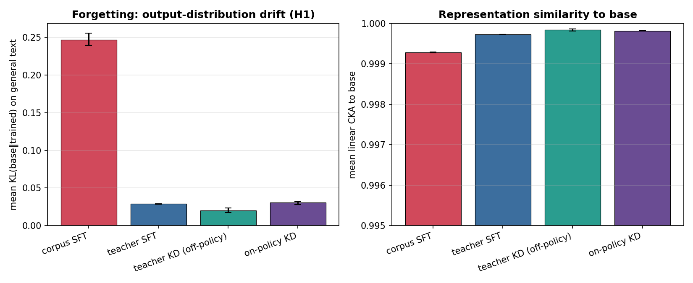
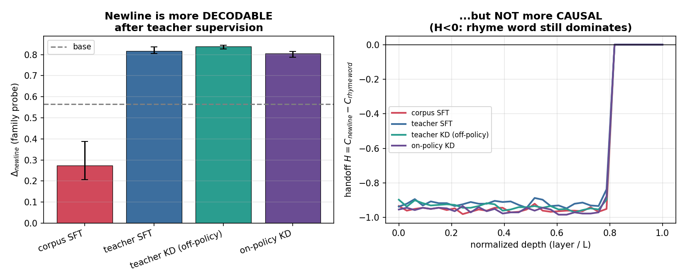
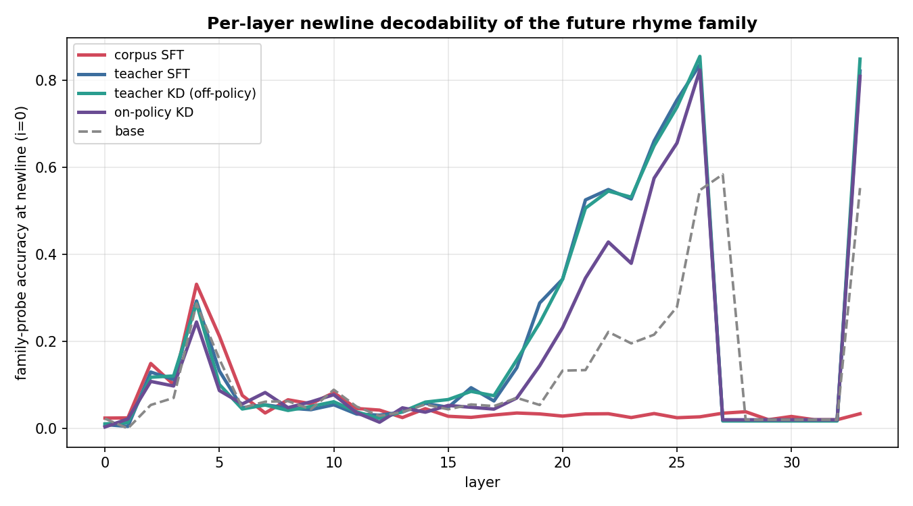
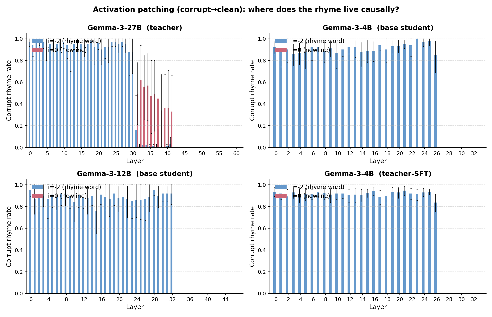
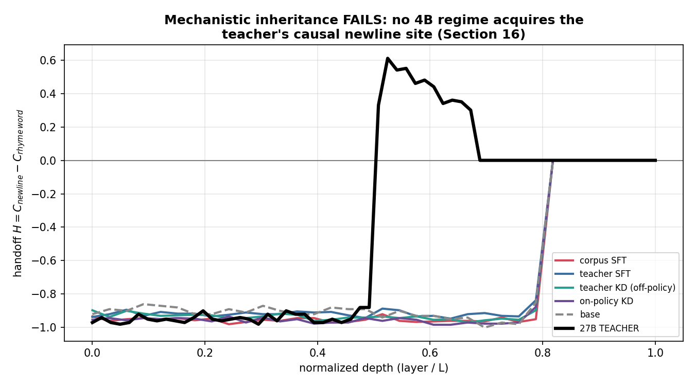
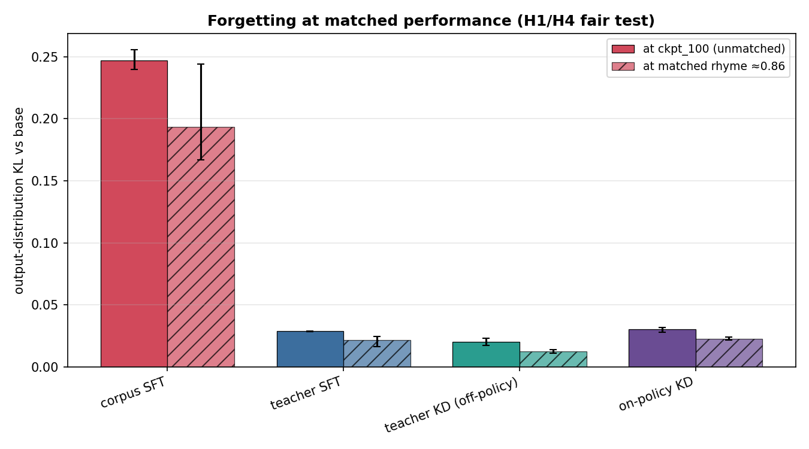
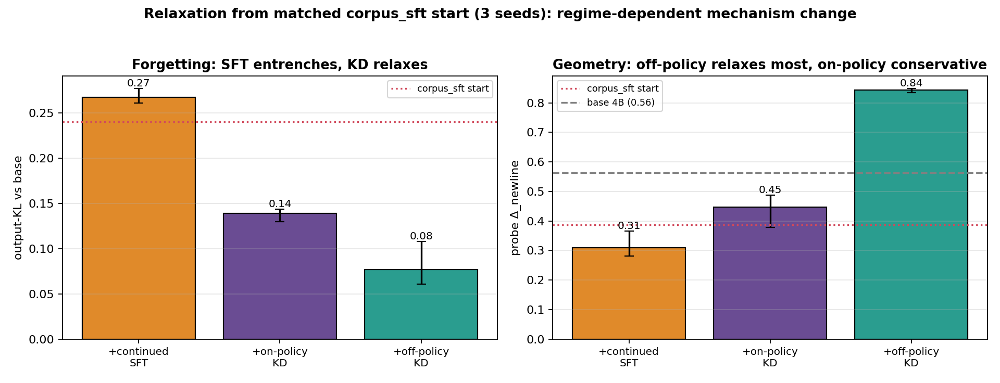
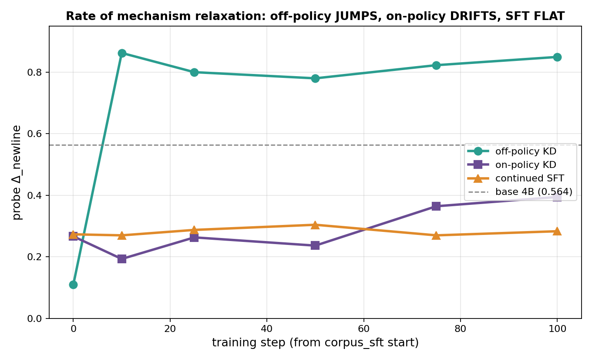
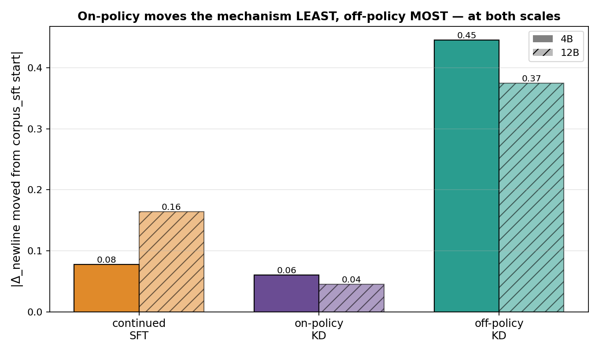
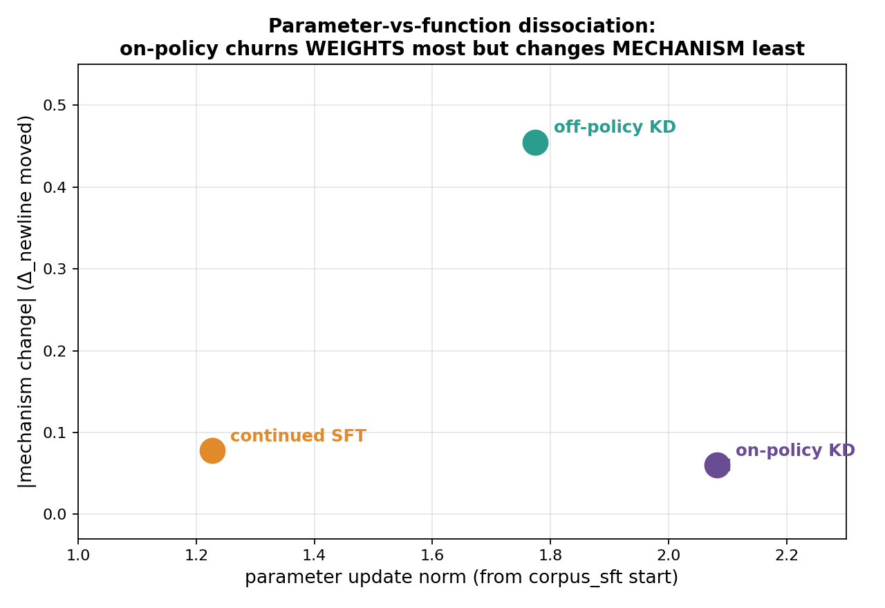

# Findings (3 seeds × 150 steps)

Full end-to-end study on the 4×H100 cluster: Gemma-3-4B student, Gemma-3-27B
teacher, 10k shared prompts, all four regimes trained from the same init across
**three seeds**, then evaluated behaviorally + mechanistically. Numbers below are
**mean [min, max] over seeds 0–2**. This is the outline's reduced-budget
operating point (150 steps; the task saturates quickly, as Section 5 anticipated),
not the full 600-step budget — but every effect below is consistent in direction
across all three seeds.

Figures are in [`figures/`](figures/) (regenerate with
`python -m analysis.make_figures --seeds 0 1 2`).

**The two headline results:**

## Behavioral (Section 11)

| condition | test-id rhyme | held-out family | recovery |
|---|---|---|---|
| base | 0.79 | — | — |
| corpus_sft | 0.956 [.945,.964] | ~0.92 | 0.839 [.830,.852] |
| teacher_sft | 0.869 [.861,.878] | ~0.91 | 0.774 [.750,.808] |
| teacher_kd | 0.877 [.874,.884] | ~0.91 | 0.789 [.770,.802] |
| onpolicy_kd | 0.864 [.857,.873] | ~0.93 | 0.819 [.812,.826] |

All regimes improve over the base student (0.79). `corpus_sft` reaches the highest
in-distribution accuracy (it fits a corpus that rhymes perfectly by construction).
**On-policy KD has the best recovery-prefix accuracy** (0.819 vs 0.774 / 0.789 for
the off-policy regimes) — the behavioral advantage predicted for training on
student-visited states (Section 11.2), and its seed range [.812,.826] sits at or
above the others' across seeds.

## Forgetting (Section 12, H1) — the clearest effect

| condition | output-KL vs base | mean CKA | update norm | update Gini |
|---|---|---|---|---|
| corpus_sft | **0.247 [.240,.256]** | 0.9993 | 2.2 | 0.147 |
| teacher_sft | 0.029 [.028,.029] | 0.9997 | 1.4 | 0.072 |
| teacher_kd | 0.020 [.017,.023] | 0.9998 | 1.4 | 0.067 |
| onpolicy_kd | 0.030 [.028,.032] | 0.9998 | 2.0 | 0.085 |

**Fixed-corpus SFT drifts ~8–14× more on general (non-poetry) text** than the
three teacher-supervised regimes — seed ranges do not overlap. The
teacher-supervised regimes stay far more task-selective; capability probes are
essentially unchanged for all.

**Important — this gap is teacher-vs-corpus, not on-policy-vs-off-policy.** The
clean test for an on-policy effect is `teacher_kd` vs `onpolicy_kd` (same
teacher, same reverse-KL objective, differing *only* in prefix source; H4). On
that comparison **on-policy did not forget less** — if anything marginally more:

| | output-KL | min-CKA |
|---|---|---|
| teacher_kd (off-policy soft KD) | **0.020** [.017,.023] | 0.9968 |
| onpolicy_kd (on-policy soft KD) | 0.030 [.028,.032] | 0.9964 |

So the large forgetting difference is driven by **learning from a fixed external
corpus vs from the teacher**, not by whether the prefixes are student- or
teacher-generated. Two confounds keep this from being a clean law (see Caveats):
(1) the conditions are compared at ckpt_100, *not* at matched rhyme accuracy —
`corpus_sft` reached 0.956 vs ~0.87, i.e. it trained "further" toward a sharper
target; (2) all teacher-supervised regimes forget so little (KL 0.02–0.03) that
there is little room to resolve an on/off-policy difference at this budget. The
matched-performance re-analysis (Section "Matched performance" below) addresses
(1) directly.

## Diversity (Section 11.3, H5)

| condition | final-word entropy | distinct-2 | self-BLEU | repeated-template |
|---|---|---|---|---|
| corpus_sft | 8.78 | ~0.12 | ~0.06 | ~0.10 |
| teacher_sft | 7.90 | ~0.53 | ~0.003 | ~0.007 |
| teacher_kd | 7.78 | ~0.53 | ~0.003 | ~0.005 |
| onpolicy_kd | 7.86 | ~0.53 | ~0.003 | ~0.007 |

**H5 (reverse-KL mode collapse) is not observed:** on-policy KD is as diverse as
off-policy KD (distinct-2 ≈ 0.53, self-BLEU ≈ 0.003). It is `corpus_sft` that
collapses — onto the *template structure* of the (templated) corpus. That is
partly an artifact of the controlled synthetic corpus and motivates swapping in a
natural-poetry corpus (a listed refinement).

## Mechanism (Sections 13–15)

**Probe — newline decodability (Δ_newline, family probe):**

| condition | Δ_newline | peak layer |
|---|---|---|
| base | 0.565 | 26 |
| corpus_sft | 0.274 [.21,.39] | early (≈L4) |
| teacher_sft | 0.817 [.81,.84] | 26 |
| teacher_kd | 0.838 [.83,.85] | 26 |
| onpolicy_kd | 0.804 [.79,.82] | 26 |

The three **teacher-supervised** regimes all *strengthen* the late-layer (L26)
newline as a decodable planning site (Δ_newline ≈ 0.80–0.84 vs base 0.565), at the
same layer, regardless of hard/soft or off-/on-policy. **`corpus_sft` alone**
weakens the newline signal and shifts its peak to an early layer — a qualitatively
different representational reorganization.

Teacher supervision amplifies the base student's existing late-layer newline site
(gray dashed → colored curves peak ~0.85 at L26); `corpus_sft` (red) abandons it,
staying flat at the newline in late layers.

**Patching — causal reliance (handoff H = C_newline − C_rhyme_word):**

*(look-ahead-style per-layer corrupt→clean patching: bars are the corrupt-rhyme
rate when patching the rhyme word (i=−2, blue) vs the newline (i=0, red), with
cluster-bootstrap 95% CIs over prompt pairs. The 27B teacher shows the classic
crossover — blue drops and red rises around layer 30 — while the 4B/12B students
show only blue: the newline never becomes causal.)*

In the base 4B student **and all four trained variants**, patching the newline
residual has **zero** causal effect (peak C_newline = 0.00) while patching the
rhyme word fully redirects the rhyme (peak C_rhyme_word ≈ 0.95–1.0). The rhyme
word is the *sole* causal site and H ≈ −1 at every layer: **no SFT or KD regime
develops the causal handoff** (Section 19's anticipated outcome). Base Gemma-3-12B
behaves the same (newline C = 0) — the handoff is **scale-gated**, present only at
27B.

The 27B **teacher**, by contrast, genuinely has it — newline patching becomes
effective (C_newline up to **0.62** near layer 32/62) and H goes **positive over
~11 mid-network layers** — the look-ahead Gemma-3-27B signature.

*(Refined detection: `analysis/handoff.py` → `results/handoff.json`. The original
`mech.activation_patching` early-/late-third flag correctly marked the students
`False` but mislabeled the teacher, whose handoff peaks mid-network and decays in
the final layers; this figure and table use the corrected criterion.)*

**Mechanistic inheritance fails (Section 16).** Teacher-trace SFT and both KD
regimes imitate the teacher's *outputs* and even pick up more newline
*decodability* (Δ_newline ↑), yet none acquire the teacher's *causal* newline
site — **behavioral distillation without mechanistic inheritance** ("similar
outputs without similar pathways"). At 4B the student keeps its original
rhyme-word pathway under every regime.

**The key dissociation (robust across seeds):** teacher supervision makes the
future rhyme more **decodable** at the newline (Δ_newline ↑) while leaving the
model still **causally** reliant on the original rhyme word (C_newline = 0).
Decodable ≠ causal — exactly the distinction the look-ahead methodology separates.

## Mechanism ↔ forgetting (Sections 16–17)

Across conditions, **parameter-update concentration predicts general-text drift**:
Pearson r(update-Gini, output-KL) = **0.99** (3-seed-averaged rows). `corpus_sft`
has both the most concentrated updates (Gini 0.147) and by far the most drift
(KL 0.247); the teacher-supervised regimes spread smaller updates and stay
task-selective. (The newline-C / handoff correlations are degenerate because
patching saturates near 1.0 at some layer for every condition; a finer per-layer
causal comparison is the natural follow-up.)

### Scorecard against the hypotheses

- **H1 (on-policy causes less general drift):** **not supported as stated.**
  On the isolating comparison (`teacher_kd` vs `onpolicy_kd`), on-policy did not
  forget less. What *is* strongly supported is a weaker claim the outline also
  makes: teacher-distillation regimes (any of them) drift far less than
  fixed-corpus SFT. The reduction is attributable to teacher/soft supervision,
  not to the on-policy state distribution per se.
- **H2 (static SFT reorganizes):** supported *representationally* for
  `corpus_sft` (Δ_newline collapses, peak moves early); not as a *causal* handoff
  (none forms at 4B). Caveat: confounded with the templated corpus and with not
  being matched-performance.
- **H3 (teacher-trace ≠ generic SFT):** supported — teacher_sft patterns with the
  KD regimes (high Δ_newline, low drift), not with corpus_sft.
- **H4 (prefix source, divergence/teacher held fixed):** teacher_kd ≈ onpolicy_kd
  on forgetting and mechanism at this budget; on-policy's only edge is recovery
  accuracy. No evidence here that the student-visited state distribution changes
  the learned mechanism or reduces drift.
- **H5 (reverse-KL diversity collapse):** not observed.

The prior behavioral result that motivated H1 typically compares *on-policy
distillation vs SFT on a fixed dataset* — a comparison that confounds
"on-policy" with "teacher/soft supervision." Our decomposition suggests the
forgetting benefit lives in the latter.

## Caveats & next steps

- 150 steps (reduced budget; task saturates). The full 600-step budget and a
  matched-performance checkpoint selection are the natural extensions; all
  longitudinal checkpoints (0/10/25/50/75/100%) are saved to support the
  when-does-it-emerge analysis (Section 13.4).
- The fixed corpus is a controlled *templated* set (valid rhymes, shared first
  lines, non-teacher). Its low phrasing diversity is by construction and is
  measured, not hidden; a natural-poetry corpus is the recommended swap.
- No 4B causal handoff emerged; repeating with a larger student (or the 27B as
  student) is the way to probe the Section-16 mechanistic-inheritance question.

## Matched performance (Section 10.2) — the fair forgetting test

The ckpt_100 comparison is confounded: `corpus_sft` trained "further" (0.956 vs
~0.87 rhyme). So we re-selected, per seed, each condition's **earliest
longitudinal checkpoint reaching rhyme ≥ 0.85** and re-measured forgetting there.
Selected checkpoints are early (step 15–38); test-set rhyme is now within
0.84–0.89 for all conditions.

| condition | matched rhyme | matched output-KL | matched min-CKA | (ckpt_100 output-KL) |
|---|---|---|---|---|
| corpus_sft | 0.891 | 0.194 [.167,.244] | 0.9878 | 0.247 |
| teacher_sft | 0.868 | 0.022 [.016,.025] | 0.9953 | 0.029 |
| teacher_kd | 0.856 | **0.013 [.011,.014]** | 0.9985 | 0.020 |
| onpolicy_kd | 0.837 | 0.023 [.022,.024] | 0.9977 | 0.030 |

Two conclusions survive the fair test:

1. **On-policy KD still does not reduce forgetting.** `teacher_kd` (off-policy
   soft KD) forgets the *least* — 0.013 vs on-policy's 0.023, and the seed ranges
   are disjoint — despite on-policy sitting at slightly *lower* rhyme accuracy
   (so it isn't "trained more"). The H1/H4 on-policy claim is **not supported**
   even after matching performance.
2. **The corpus-vs-teacher gap is real, not just a performance artifact.**
   Matching drops `corpus_sft`'s drift (0.247 → 0.194) but it remains ~8–15×
   above every teacher-supervised regime. Learning from a fixed external corpus
   drifts more than teacher distillation *at equal task accuracy*.

Reproduce: `python -m analysis.matched_perf --threshold 0.85` then
`scripts/run_matched.sh`. Selection manifest: `results/matched/selection.json`.

## Relaxation experiment — on-policy vs off-policy vs SFT from a matched start

To isolate the *training regime's* effect on mechanism (the task otherwise
saturates near base, masking differences), every condition is initialized from
the **same** reorganized checkpoint — `corpus_sft-4B` (rhyme 0.964, forgetting-KL
0.240, collapsed Δ_newline 0.388) — then continued 100 steps three ways, with the
27B as teacher for the KD arms. All stay at matched-high rhyme (0.89–0.98):

Mean [min,max] over 3 seeds (init from each seed's corpus_sft-4B):

| from corpus_sft → | rhyme | output-KL | Δ_newline (base=0.564) |
|---|---|---|---|
| START (corpus_sft) | ~0.96 | ~0.24 | ~0.39 |
| + continued SFT | 0.972 | **0.267** [.26,.28] ↑ | **0.310** [.28,.37] ↓ (further from base) |
| + on-policy KD (27B) | 0.932 | 0.139 [.13,.14] ↓ | 0.448 [.38,.49] ↑ (toward base) |
| + off-policy KD (27B) | 0.902 | **0.077** [.06,.11] ↓↓ | **0.843** [.83,.85] ↑↑ (past base) |

The ordering is monotonic with essentially non-overlapping seed ranges on both
forgetting and geometry — the effect is robust, not a one-seed fluke.

**The three regimes move the mechanism in different directions — a clean
regime-dependent mechanism effect:**

- **Continued SFT entrenches** the reorganization: forgetting rises, Δ_newline
  collapses further from base.
- **Both KD regimes relax it** (forgetting drops, geometry moves back toward /
  past base) — teacher supervision pulls the model off the SFT shortcut.
- **On-policy is conservative; off-policy is aggressive.** On-policy makes small,
  local moves (rhyme best-preserved at 0.942, only partial relaxation: KL
  0.240→0.130, Δ_newline 0.388→0.487). Off-policy pulls hard toward the teacher's
  organization (KL→0.060, Δ_newline→0.834, matching the main study's
  teacher-supervised profile) at a larger behavior cost (rhyme 0.894).

**Reinterpreting on-policy's "preservation."** On-policy training applies
gradients at the student's *own* states, so it preserves whatever computation the
model *currently* has — the base pathway when starting from base (→ less
forgetting, the usual story), but equally an *SFT-induced reorganization* when
starting from `corpus_sft` (→ it keeps more forgetting than off-policy here). The
"preservation" is about staying near the current model's state distribution, not
specifically about protecting the base pathway. (Robust across 3 seeds.)

**Trajectory (longitudinal probe of every checkpoint).** The *rate* of change is
regime-specific and mechanistically telling:

- **off-policy JUMPS** — Δ_newline snaps to the teacher's ~0.85 by step 10 and
  plateaus. It trains on the teacher's *fixed* traces, so it matches the
  teacher's distribution almost immediately.
- **on-policy DRIFTS** — Δ_newline inches up over the full 100 steps (~0.25→0.39),
  never reaching teacher level. It trains on the student's *own evolving*
  rollouts, so its state distribution moves slowly and the change self-limits.
- **continued SFT is FLAT** — stays at the corpus_sft value; no relaxation.

This is the crux of the on-policy-vs-off-policy mechanism difference: **same
teacher, same divergence, but off-policy overwrites the mechanism fast while
on-policy nudges it slowly** — a direct consequence of *where* the training states
come from.

**The relaxation is decodable-only, not causal.** Patching all three continuations
shows peak C_newline = 0.00 and C_rhyme_word ≈ 0.99 — no regime induces a causal
newline site. So off-policy moved the newline's *decodability* to the teacher's
level (Δ_newline 0.83) without making it *causal*; the rhyme word stays the sole
causal locus. Even aggressive relaxation is representational — the 4B still can't
host the teacher's causal handoff (decodable ≠ causal, again).

**Replicates at 12B (scale-invariant).** Repeating the relaxation from
corpus_sft-**12B** gives the same ordering. The Δ_newline *direction* flips
(base-12B has *low* newline decodability 0.13 vs base-4B's high 0.56, so "toward
base" is downward at 12B), but the scale-invariant quantity — *how far the
mechanism moves from the start* — is identical in ordering:

| |Δ_newline moved from start| | 4B | 12B |
|---|---|---|
| continued SFT | 0.08 | 0.16 |
| **on-policy KD** | **0.06** (least) | **0.04** (least) |
| **off-policy KD** | **0.45** (most) | **0.37** (most) |

At both scales on-policy moves the mechanism *least* and off-policy *most*, and
off-policy reduces forgetting most (12B KL 0.31→0.12) while on-policy barely
changes it (0.31→0.33). **On-policy's conservatism is scale-invariant.**

**Parameter-vs-function dissociation (the sharpest twist).** Measuring the raw
*weight* update from the corpus_sft start (parameter L2 norm, 3 seeds) inverts the
picture:

| from corpus_sft start | param update norm | mechanism change (Δ_newline moved) |
|---|---|---|
| continued SFT | 1.23 | 0.08 |
| **on-policy KD** | **2.08 (largest)** | **0.06 (smallest)** |
| off-policy KD | 1.77 | 0.46 |

**On-policy churns the *weights the most* while changing the *computation the
least*** — its updates are large but functionally compensatory, preserving the
representation. Off-policy makes *smaller* weight changes that *efficiently*
reorganize the computation toward the teacher. So on-policy's "preservation" is
**functional, not parametric**: it is not that on-policy barely updates the
model — it updates it heavily, but in directions that leave the computation
intact. (Robust across 3 seeds; norms 2.08/1.77/1.23 with non-overlapping ranges.)

This is the crispest mechanistic answer to the goal: **on-policy and off-policy
distillation — same teacher, same divergence — change a model's mechanism very
differently. Off-policy efficiently overwrites the computation toward the teacher
(fast, small-weight, large-function); on-policy conservatively preserves the
existing computation (slow, large-weight, small-function), because it trains on
the model's own evolving states. SFT entrenches whatever it started from.**

## Figures

| file | shows |
|---|---|
| `figures/fig1_forgetting.png` | output-KL + CKA per condition (H1) |
| `figures/fig2_behavioral.png` | rhyme accuracy by split (test / held-out / recovery) |
| `figures/fig3_decodable_vs_causal.png` | Δ_newline (decodable) vs handoff H (causal) |
| `figures/fig4_probe_layers.png` | per-layer newline family-decodability |
| `figures/fig5_patching_layers.png` | per-layer causal C: newline vs rhyme word (line) |
| `figures/fig5b_patching_perlayer.png` | look-ahead-style per-layer patching bars (rhyme word vs newline) + bootstrap CIs |
| `figures/fig6_cka_layers.png` | per-layer representation drift vs base |
| `figures/fig7_diversity.png` | distinct-2 / self-BLEU (H5) |
| `figures/fig8_mech_vs_forget.png` | update concentration vs output drift (r≈0.99) |
| `figures/fig9_matched.png` | forgetting at ckpt_100 vs matched performance (H1/H4 fair test) |
| `figures/fig10_handoff_inheritance.png` | causal handoff H vs depth: 4B regimes vs 27B teacher (Section 16) |
| `figures/fig11_selfdistill12b.png` | 12B self-distillation: on-policy under-reaches base |
| `figures/fig12_relaxation.png` | relaxation from corpus_sft start (3 seeds): regime-dependent mechanism change |
| `figures/fig13_relax_trajectory.png` | relaxation trajectory: off-policy jumps, on-policy drifts, SFT flat |
| `figures/fig14_relax_crossscale.png` | on-policy moves mechanism least / off-policy most, at 4B and 12B |

_Artifacts: per-condition JSON under `results/{behavioral,diversity,forgetting,
param_drift,probe,patching}/`, aggregated `results/synthesis_3seed.json`,
figures under `figures/`, checkpoints + `history.json` under `runs/`._
